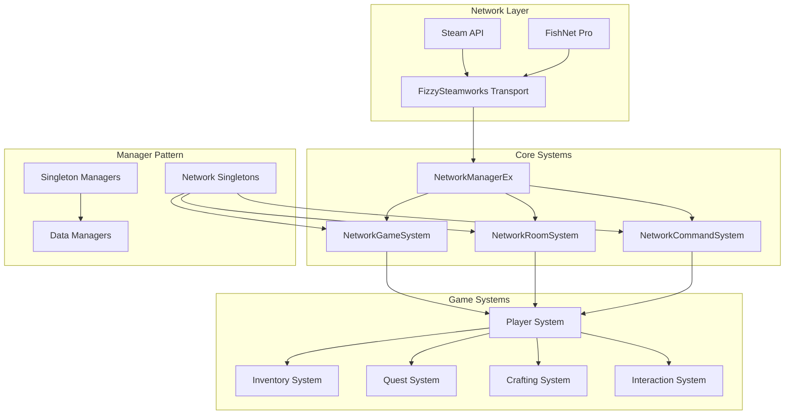
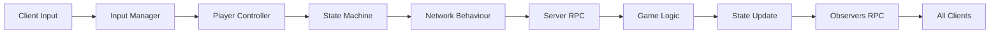
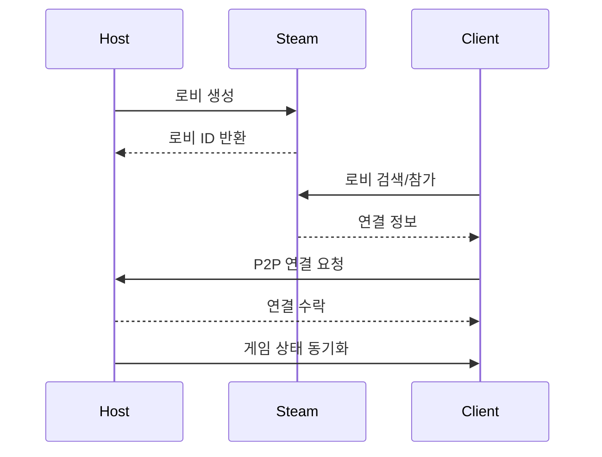

# 🛠️ Description
- **프로젝트 소개** <br>
Sunset Survival은 **Unity 6**와 **FishNet** 네트워킹 프레임워크를 기반으로 개발한 **비대칭 멀티플레이어 서바이벌 게임**입니다. 플레이어는 **생존자** 또는 **살인마** 역할을 맡아 긴장감 넘치는 심리전과 전략적 게임플레이를 경험합니다. <br>
**직접 제작한 사운드**를 통해 높은 몰입감을 구현하였으며, **아이템을 파밍하고 제작**하여 **퀘스트**를 클리어하는 구조로 게임이 진행됩니다.

- **개발 기간** : 2025.04.22 ~ 2025.05.28
- **개발 인원** : 3인 개발
- **사용 기술** <br>

  | 언어 | 엔진 | 네트워킹 프레임워크 | 데이터 연동 라이브러리 |
  |----|----|----|----|
  | C# | Unity 6 | FishNet | Unity Google Sheet | 

<br><br>

---
# 🤝 팀원(역할 분담)

| 염기용 | 박관우 | 김영송 |
|----|----|----|
| 플레이어 로직 | 사운드 제작 및 적용 | 개발 프레임워크 |
| 네트워크 | 채팅 UI | UI |

<br><br>
<br><br>

---
# 📁 프로젝트 구조

```
Assets/
├── 0. External              - 외부 에셋 및 라이브러리
├── 1. Scene                 - 게임 씬 파일
├── 2. AddressableAssets     - 어드레서블 에셋
├── 3. Font                  - 게임 폰트
├── 4. Animation             - 애니메이션 및 컨트롤러
├── 5. Datas                 - SO 에셋 인스턴스 및 각종 데이터
├── 6. Prefab                - 프리팹 객체
├── Scripts                  - 게임 스크립트
│   ├── 1. Entity            - 게임 엔티티 관련
│   ├── 2. Controller        - 컨트롤러
│   ├── 3. Handler           - 핸들러 클래스
│   ├── 4. Manager           - 매니저 클래스
│   ├── 5. UI                - UI 스크립트
│   ├── 6. Scene             - 씬 관련 스크립트
│   ├── 7. Data              - 데이터 스크립트
│   ├── Editor               - 에디터 스크립트
│   ├── Steamworks.NET       - Steam 통합
│   └── Utils                - 유틸리티 클래스
├── Resources/               - 리소스 파일
└── UGS.Generated/           - Unity Gaming Services 생성 파일
```

<br><br>
<br><br>

---
# 🎮 시연 영상 (이미지 클릭시 유튜브 링크로 이동합니다)

<a href="https://youtu.be/7PB0w4Xyckg" target="_blank">
  


<br><br>
<br><br>
<br><br>

---


# 🎮핵심 구현 요소
### 인벤토리


- **핵심 기능** <br>
  아이템 드래그 & 드롭 <br>
  슬롯 합치기 <br>
  아이템 버리기 <br>
  아이템 타입별로 보기 <br>
  
- 인벤토리 데이터와 UI를 나누어서 설계했습니다. Event 기반으로 인벤토리 데이터가 변경되면 UI로 출력되도록 했습니다.

<br><br>

---

### 상호작용 시스템


- **핵심 기능** <br>
  근처의 상호작용이 가능한 물건을 탐지 <br>
  상호작용이 가능한 상태의 물건에 외각선 표사 <br>

- 상호작용 키를 누르면 상호작용 애니메이션이 실행되고 상호작용이 되도록 설계 했습니다. <br>
- 또한 셰이더를 통해 외각선이 보이게하여 직관적으로 접근할 수 있도록 했습니다. <br>
- 근처의 오브젝트 탐지시 Unity의 OnTriggerEnter와 OnTriggerExit 함수를 활용했으며, <br>
  HashSet을 통해 오브젝트를 관리하여 중복 감지를 예방 했습니다. <br>
- 아이템 줍기의 경우 네트워크상에서 한명만 습득이 가능하도록 했습니다.


- **소스 코드** <br>
  ```csharp
  public class InteractionHandler : MonoBehaviour
  {
      private HashSet<Interactable> interactables = new HashSet<Interactable>();
      
      public Interactable GetInteractObject(bool Remove = false)
      {
          // 거리 기반 우선순위 정렬
          // 인벤토리 공간 체크
          // 아이템 타입별 상호작용 가능 여부 확인
      }
  }
  ```

</details>

<details>
<summary>상호작용 가능 객체</summary>

  | 객체 타입 | 설명 | 네트워크 동기화 |
  |----------|------|-----------------|
  | `StorageBox` | 공유 저장소 | ✅ 실시간 동기화 |
  | `CraftingTable` | 제작대 | ✅ 제작 과정 동기화 |
  | `QuestStorageBox` | 퀘스트 아이템 보관함 | ✅ 진행도 공유 |
  | `ItemObject` | 드롭된 아이템 | ✅ 픽업 즉시 동기화 |

</details>

<details>
<summary>상호작용 흐름도</summary>

  ```mermaid
  sequenceDiagram
      participant P as Player
      participant IH as InteractionHandler
      participant I as Interactable
      participant N as Network
      
      P->>IH: 상호작용 입력
      IH->>IH: 범위 내 객체 검색
      IH->>I: Interact() 호출
      I->>N: ServerRpc 전송
      N->>N: 모든 클라이언트 동기화
      N->>I: ObserversRpc 실행
  ```

</details>

<br><br>

---

### 퀘스트 시스템


- 미션 위주의 게임을 설계하기 위해 퀘스트 시스템을 만들었습니다. <br>
  데이터 테이블을 활용하여 퀘스트를 작성하였고 퀘스트와 퀘스트 작업을 나누어서 관리했습니다. <br>
  퀘스트가 여러개의 작업을 가질 수 있도록 구현했습니다. <br>
  또한 작업을 완료하면 연결된 다른 작업이 생성되는 기능을 linkedTask를 통해 설정할 수 있게 했습니다. <br>

- 퀘스트의 진행도를 올리는 설계 방법은 퀘스트의 행동이 발생하는 곳에서 <br>
  해당 행동의 카테고리와 행동의 주체가 되는 Object의 ID값을 통해 진행도를 업데이트 합니다.


<details>
<summary>📋 퀘스트 구조 코드</summary>

```csharp
public class Quest
{
    public QuestData QuestData { get; private set; }
    public List<Task> Tasks { get; private set; }
    public event Action<Quest> onCompleted;
}
```

#### 진행 추적 시스템
```csharp
public void ReceiveReport(ETaskCategory category, int targetId, int successCount = 1)
{
    foreach (var quest in activeQuests.ToArray())
        quest.RecieveReport(category, targetId, successCount);
}
```

</details>

<br><br>

---

### 제작 시스템


- 아이템을 제작하는 기능을 만들었습니다. <br>
  데이터 테이블을 통해 어떤 아이템을 어떤 재료로 만들 수 있는지 읽어드렸습니다. <br>
  인벤토리를 실시간으로 탐색하여 아이템을 만들 수 있는지, 또 몇개를 만들 수 있는지 검사하고, UI에 표시합니다 <br>
  인벤토리 탐색 속도를 개선하기 위해 아이템 ID를 Key로 해당 아이템이 있는 아이템 슬롯을 Value로 하여 Dictionary에 넣고 탐색하는 방식을 사용했습니다. <br>

  
<br><br>

---

### 보관함


- 아이템을 보관함을 통해 유저들과 공유할 수 있게 했습니다. <br>
  플레이어가 아이템을 옮겨서 보관함에 변화가 생기면 해당 정보를 모든 유저에게 전달하는 방식으로 구현했습니다.
  
<br><br>

---


### 퀘스트 보관함


- 보관함에 아이템을 채우는 퀘스트를 만들었습니다. <br>
  데이터테이블을 통해 어떤 아이템을 채워넣어야하는지 설정할 수 있도록 설계했습니다. <br>
  보관함을 채우는 퀘스트의 경우 보관함 채우는 카테고리와 해당 보관함의 ID 값을 통해 퀘스트 진행도를 업데이트 합니다 <br>
  퀘스트 보관함에 아이템을 넣을 때, 네트워크상의 모든 유저에게 해당 정보를 공유하도록 하였습니다.
  
<br><br>

---

### 아이템 슬롯
 
<br>


<br>

- 인벤토리, 퀵슬롯, 보관함, 제작대, 퀘스트 보관함 모두 같은 아이템 슬롯을 활용해서 구현했습니다. <br>
  슬롯에 담고 있는 아이템에 따라 배경색이 달라지도록 구현했으며, <br>
  마우스 호버시 아이템의 정보가 출력되도록 했습니다. 아이템에 효과가 있다면 해당 정보도 함께 출력됩니다. <br>
  무기의 경우 내구도가 표시되도록 했습니다. <br>

<br><br>

---


## 🏗️ 기술 아키텍처

<details>
<summary>🏛️ 시스템 아키텍처 다이어그램</summary>



</details>

### 핵심 설계 패턴

<details>
<summary>🔧 Singleton 패턴</summary>

```csharp
public class Singleton<T> : MonoBehaviour where T : MonoBehaviour
{
    private static T _instance;
    public static T Instance 
    { 
        get 
        {
            if (_instance == null)
            {
                _instance = FindObjectOfType<T>();
                if (_instance == null)
                {
                    GameObject singleton = new GameObject(typeof(T).Name);
                    _instance = singleton.AddComponent<T>();
                }
            }
            return _instance;
        }
    }
}
```

</details>

<details>
<summary>🌐 NetworkSingleton 패턴</summary>

```csharp
public class NetworkSingleton<T> : NetworkBehaviour where T : NetworkBehaviour
{
    public static T Instance { get; private set; }
    
    public override void OnStartNetwork()
    {
        if (Instance != null && Instance != this)
        {
            Destroy(gameObject);
            return;
        }
        Instance = this as T;
    }
}
```

</details>

<details>
<summary>🎮 State Machine 패턴</summary>

```csharp
public class AlivePlayerStateMachine
{
    public AlivePlayerMovementStateMachine MovementStateMachine { get; }
    public AlivePlayerCombatStateMachine CombatStateMachine { get; }
    
    // 계층적 상태 관리로 복잡한 플레이어 행동 제어
}
```

</details>

<details>
<summary>📊 데이터 플로우</summary>



</details>

<br><br>
<br><br>

---

## 🌐 네트워크 시스템

### FishNet Pro 통합

#### 주요 기능
- **NetworkObject 자동 동기화**
- **SyncVar 실시간 변수 동기화**
- **RPC 원격 프로시저 호출**

<details>
<summary>🔧 네트워크 동기화 전략</summary>

1. **NetworkObject 관리**
   ```csharp
   [RequireComponent(typeof(NetworkObject))]
   public class AlivePlayer : NetworkBehaviour, IDamageable
   {
       // 자동 동기화되는 플레이어 엔티티
   }
   ```

2. **SyncVar 활용**
   ```csharp
   public readonly SyncVar<GameOptions> GameOptions = new SyncVar<GameOptions>();
   public readonly SyncDictionary<NetworkConnection, PlayerInfo> Players = new SyncDictionary<>();
   ```

3. **RPC 패턴**
   - `[ServerRpc]`: 클라이언트 → 서버
   - `[ObserversRpc]`: 서버 → 모든 관찰자
   - `[TargetRpc]`: 서버 → 특정 클라이언트

</details>

### Steam 네트워킹 통합

<details>
<summary>🎮 로비 시스템</summary>

```csharp
public class NetworkRoomSystem : NetworkSingleton<NetworkRoomSystem>
{
    public readonly SyncDictionary<NetworkConnection, ColorType> PlayerColors;
    public readonly SyncDictionary<NetworkConnection, ulong> NetworkConnectionToSteamId;
    
    // Steam 로비 생성/참가/검색 기능
    // 자동 매치메이킹
    // 친구 초대 시스템
}
```

</details>

<details>
<summary>🔄 P2P 연결 관리</summary>



</details>

<br><br>
<br><br>

---

## 🚀 설치 및 실행

### 시스템 요구사항

| 구분 | 최소 사양 | 권장 사양 |
|------|----------|----------|
| **OS** | Windows 10 64-bit | Windows 11 64-bit |
| **CPU** | Intel i5-8400 | Intel i7-10700 |
| **RAM** | 8GB | 16GB |
| **GPU** | GTX 1060 6GB | RTX 3060 |
| **DirectX** | Version 11 | Version 12 |
| **Storage** | 10GB | 20GB SSD |

### 빠른 시작 가이드

#### 🌐 멀티플레이어 테스트

1. **호스트 시작**
   - "Create Room" 클릭
   - 로비 설정 후 "Start"

2. **클라이언트 참가**
   - 로비 목록에서 선택

<details>
<summary>🔧 개발 환경 설정 상세</summary>

#### 1. 필수 소프트웨어 설치

```bash
# Unity Hub 설치 후
Unity 6000.0.47f1 설치

# Visual Studio 2022 설치 시 필수 구성 요소
- .NET desktop development
- Game development with Unity
- .NET Core cross-platform development
```

#### 2. 프로젝트 클론 및 설정

```bash
# 저장소 클론
git clone [repository-url]
cd PROJECT_MS

# Git LFS 초기화 (대용량 에셋 관리)
git lfs install
git lfs pull
```

#### 3. Unity 프로젝트 설정

1. **Unity Hub에서 프로젝트 열기**
   - "Add" → 프로젝트 폴더 선택
   - Unity 6000.0.47f1 버전 선택

2. **필수 패키지 확인**
   ```
   Window > Package Manager
   - FishNet Pro (임포트 확인)
   - Addressables 2.4.3
   - Universal RP 17.0.4
   - Cinemachine 3.1.3
   - Input System 1.14.0
   ```

3. **Addressables 빌드**
   ```
   Window > Asset Management > Addressables > Groups
   Build > New Build > Default Build Script
   ```

4. **Steam 설정**
   - Steam 클라이언트 실행
   - `steam_appid.txt` 확인 (기본값: 480)

</details>

<br><br>
<br><br>

---

## 💻 개발 가이드

### 코드 컨벤션

| 요소 | 규칙 | 예시 |
|------|------|------|
| **클래스** | PascalCase | `PlayerController` |
| **인터페이스** | I + PascalCase | `IInteractable` |
| **메서드** | PascalCase | `TakeDamage()` |
| **변수** | camelCase | `playerHealth` |
| **상수** | UPPER_SNAKE_CASE | `MAX_PLAYERS` |
| **private 필드** | _ + camelCase | `_instance` |

<details>
<summary>📁 파일 구조</summary>

```
Scripts/
├── 1. Entity/          # 게임 객체 (플레이어, 아이템 등)
├── 2. Controller/      # 컨트롤러 (입력, AI)
├── 3. Handler/         # 핸들러 (상호작용, 아이템)
├── 4. Manager/         # 매니저 (시스템, 데이터)
├── 5. UI/             # UI 컴포넌트
├── 6. Scene/          # 씬별 스크립트
├── 7. Data/           # 데이터 구조
└── Utils/             # 유틸리티
```

</details>

<details>
<summary>🆕 새로운 시스템 추가하기</summary>

#### 1. NetworkBehaviour 생성

```csharp
using FishNet.Object;
using FishNet.Object.Synchronizing;

public class MyNewSystem : NetworkBehaviour
{
    // 동기화될 변수
    [SyncVar(OnChange = nameof(OnValueChanged))]
    private int _syncedValue;
    
    public override void OnStartNetwork()
    {
        base.OnStartNetwork();
        if (IsServerStarted)
        {
            // 서버 초기화
        }
    }
    
    [ServerRpc]
    private void RequestAction(int value)
    {
        // 서버에서 처리
        _syncedValue = value;
    }
    
    private void OnValueChanged(int prev, int next, bool asServer)
    {
        // 값 변경 시 모든 클라이언트에서 실행
    }
}
```

#### 2. Manager 패턴 활용

```csharp
public class MyManager : IManager
{
    public void Init()
    {
        // 매니저 초기화
        // 이벤트 등록
        // 리소스 로드
    }
    
    public void Clear()
    {
        // 정리 작업
        // 이벤트 해제
        // 메모리 정리
    }
}

// Managers 클래스에 추가
public static MyManager MyManager { get { return Instance?._myManager ?? null; } }
```

</details>

<br><br>
<br><br>

---

## 📚 API 문서

<details>
<summary>🎮 플레이어 시스템 API</summary>

#### AlivePlayer

```csharp
public class AlivePlayer : NetworkBehaviour, IDamageable
{
    // 속성
    public HealthResource Health { get; private set; }
    public StaminaResource Stamina { get; private set; }
    public Inventory Inventory { get; private set; }
    
    // 핸들러
    public InteractionHandler InteractionHandler { get; private set; }
    public QuickSlotHandler QuickSlotHandler { get; private set; }
    public ItemHandler ItemHandler { get; private set; }
    public PlacementHandler PlacementHandler { get; private set; }
    public EquipHandler EquipHandler { get; private set; }
    
    // 이벤트
    public event Action onDead;
    public event Action onDamaged;
    
    // 주요 메서드
    [ServerRpc]
    public void TakeDamage(float damage, NetworkConnection conn = null);
    
    [ServerRpc]
    public void RestoreHunger(float amount);
}
```

</details>

<details>
<summary>📦 인벤토리 API</summary>

#### Inventory 클래스

```csharp
public class Inventory
{
    // 아이템 추가
    public bool AddItem(ItemData itemData, int amount = 1, int durability = 0);
    
    // 아이템 제거
    public bool RemoveItem(ItemData itemData, int amount);
    
    // 아이템 교환
    public static void SwapItem(ItemSlot from, ItemSlot to);
    
    // 빈 슬롯 확인
    public bool HasEmptySlot();
}
```

#### Storage 클래스

```csharp
public class Storage
{
    // 슬롯 접근
    public ItemSlot GetSlotByIdx(int idx);
    public List<ItemSlot> GetSlotsByCondition(Func<ItemSlot, bool> condition);
    
    // 슬롯 생성
    public ItemSlot CreateSlot();
    
    // 아이템 관리
    public bool AddItem(ItemData itemData, int amount = 1, int durability = 0);
    public bool RemoveItem(ItemData data, int amount = 1);
    
    // 검색
    public ItemSlot FindSlotByItemData(ItemData itemData, int amount = 1);
    public ItemSlot FindFirstEmptySlot();
}
```

</details>

<details>
<summary>🌐 네트워크 시스템 API</summary>

#### NetworkGameSystem

```csharp
public class NetworkGameSystem : NetworkSingleton<NetworkGameSystem>
{
    // 게임 상태
    public bool IsGameStarted;
    public readonly SyncVar<GameOptions> GameOptions;
    public readonly SyncDictionary<NetworkConnection, PlayerInfo> Players;
    
    // 게임 제어
    [Server]
    public void StartGame();
    
    [Server]
    public void EndGame(EPlayerRole winner);
    
    // 플레이어 관리
    public EPlayerRole GetPlayerRole(NetworkConnection connection);
    
    [ServerRpc(RequireOwnership = false)]
    public void OnPlayerDead(NetworkConnection connection = null);
}
```

</details>

<details>
<summary>📋 퀘스트 시스템 API</summary>

#### QuestManager

```csharp
public class QuestManager : IManager
{
    // 퀘스트 등록
    public Quest Register(int questId);
    public Quest Register(QuestData questData);
    
    // 진행도 보고
    public void ReceiveReport(ETaskCategory category, int targetId, int successCount = 1);
    
    // 퀘스트 취소
    public void QuestCancel(Quest quest);
    
    // 이벤트
    public event Action<Quest> onQuestRegistered;
    public event Action<Quest> onQuestCompleted;
    public event Action<Quest> onQuestCanceled;
}
```

</details>

<br><br>
<br><br>

---

## ⚡ 성능 최적화

<details>
<summary>💾 메모리 최적화</summary>

#### 1. Object Pooling

```csharp
public class PoolManager : IManager
{
    private Dictionary<string, Queue<GameObject>> _pools = new Dictionary<string, Queue<GameObject>>();
    
    public GameObject Get(string prefabPath)
    {
        if (_pools.TryGetValue(prefabPath, out var pool) && pool.Count > 0)
        {
            return pool.Dequeue();
        }
        
        return Instantiate(Resources.Load<GameObject>(prefabPath));
    }
    
    public void Return(string prefabPath, GameObject obj)
    {
        if (!_pools.ContainsKey(prefabPath))
            _pools[prefabPath] = new Queue<GameObject>();
            
        obj.SetActive(false);
        _pools[prefabPath].Enqueue(obj);
    }
}
```

#### 2. Addressables 활용

```csharp
// 비동기 에셋 로딩
public async UniTask<T> LoadAssetAsync<T>(string key) where T : UnityEngine.Object
{
    var handle = Addressables.LoadAssetAsync<T>(key);
    await handle.Task;
    return handle.Result;
}

// 메모리 해제
public void ReleaseAsset(string key)
{
    Addressables.Release(key);
}
```

</details>

<details>
<summary>🎨 렌더링 최적화</summary>

#### 1. LOD (Level of Detail) 설정
- 거리별 메시 품질 조절
- 텍스처 해상도 동적 변경

#### 2. 오클루전 컬링
- Frustum Culling 자동 적용
- Occlusion Culling 베이크

#### 3. 배치 최적화
- Static Batching 활용
- GPU Instancing 설정
- SRP Batcher 활성화

</details>

<br><br>
<br><br>

---

## 📦 배포 가이드

### 빌드 설정

| 빌드 타입 | 용도 | 설정 |
|----------|------|------|
| **Development** | 디버깅 | Development Build ✅, Script Debugging ✅ |
| **Release** | 배포 | Mono, Optimize Mesh Data ✅ |

<details>
<summary>⚙️ Player Settings 구성</summary>

```
Edit > Project Settings > Player
├── Company Name: YourCompany
├── Product Name: PROJECT_MS
├── Version: 1.0.0
├── Icon: 게임 아이콘 설정
└── Splash Screen: 스플래시 이미지 설정
```

</details>

<details>
<summary>🎮 Steam 배포</summary>

#### 1. Steamworks 설정

```bash
# steam_appid.txt 수정
480  # 개발용 (Spacewar)
↓
YOUR_APP_ID  # 실제 App ID
```

#### 2. 빌드 후 처리

```powershell
# 빌드 자동화 스크립트
.\build.ps1 -Configuration Release -Platform Win64 -SteamUpload
```

</details>

<br><br>
<br><br>

---

## 🔧 문제 해결

<details>
<summary>🚨 일반적인 문제</summary>

#### 1. Steam 연결 실패

**증상**
```
SteamAPI_Init() failed
Steam API 초기화 실패
```

**해결 방법**
1. Steam 클라이언트 실행 확인
2. `steam_appid.txt` 파일 존재 확인
3. 파일 내용이 `480`인지 확인
4. Steam 재시작

#### 2. Addressables 오류

**증상**
```
Failed to load asset bundle
InvalidKeyException: key not found
```

**해결 방법**
1. Addressables Groups 창 열기
2. "Clean Build" → "New Build"
3. 로컬 서버 실행 확인

</details>

<details>
<summary>🌐 네트워킹 시스템 문제 해결</summary>

### **FishNet 네트워킹 프레임워크 관련 이슈**

#### **문제 상황: NetworkBehaviour 초기화 실패**

**증상**: NetworkBehaviour 컴포넌트가 제대로 초기화되지 않아 RPC 호출이 실패하거나 동기화가 되지 않는 문제

**원인 분석**:
- `OnStartNetwork()` 메서드에서 필수 컴포넌트 초기화 누락
- NetworkObject가 제대로 스폰되지 않음
- 클라이언트와 서버 간의 초기화 순서 문제

**해결 방법**:
```csharp
// Assets/Scripts/1. Entity/Player/AlivePlayer/AlivePlayer.cs 참조
public override void OnStartNetwork()
{
    base.OnStartNetwork();

    // 필수 컴포넌트 초기화
    InteractionHandler = GetComponent<InteractionHandler>();
    CharacterController = GetComponent<CharacterController>();
    Animator = GetComponentInChildren<Animator>();

    // NetworkObject 유효성 검증
    if (!NetworkObject.IsValid)
    {
        Debug.LogError("NetworkObject is not valid!");
        return;
    }
}
```

**예방 조치**:
- NetworkBehaviour 상속 클래스에서 항상 `base.OnStartNetwork()` 호출
- 네트워크 관련 초기화는 `OnStartClient()` 또는 `OnStartServer()`에서 수행
- NetworkObject의 유효성을 항상 검증

#### **문제 상황: RPC 호출 실패**

**증상**: ServerRpc 또는 ObserversRpc 호출이 실행되지 않거나 예외 발생

```csharp
// 올바른 RPC 구현 예시
[ServerRpc(RequireOwnership = false)]
public void TakeDamage(float damage, NetworkConnection conn = null)
{
    if (isDead) return;

    // 네트워크 연결 상태 확인
    if (!InstanceFinder.IsServerStarted)
    {
        Debug.LogWarning("Server is not started, cannot process damage");
        return;
    }

    Health.Subtract(damage);

    if (Health.Current.Value <= 0 && conn != null)
    {
        NetworkGameSystem.Instance.UpdatePlayerKillCount(conn);
    }
}
```

### **클라이언트-서버 동기화 문제**

#### **문제 상황: 네트워크 타입 전환 실패**

**증상**: TCP/UDP에서 Steam P2P로 전환 시 연결이 실패하거나 불안정

**원인 분석**:
```csharp
// Assets/Scripts/4. Manager/Core/NetworkManagerEx.cs 참조
public void OnValidate()
{
    if (networkManagerTCP_UDP == null || networkManagerSteam == null)
        return;

    if(Type == NetworkType.TCP_UDP)
    {
        networkManagerTCP_UDP.gameObject.SetActive(true);
        networkManagerSteam.gameObject.SetActive(false);
    }
    else
    {
        networkManagerTCP_UDP.gameObject.SetActive(false);
        networkManagerSteam.gameObject.SetActive(true);
    }
}
```

**해결 방법**:
- 네트워크 타입 변경 전 기존 연결 완전 종료
- Steam 초기화 상태 확인 후 P2P 연결 시도
- 네트워크 매니저 인스턴스 중복 방지

</details>

<details>
<summary>🎮 Steam 통합 문제 해결</summary>

### **Steam API 초기화 실패**

#### **문제 상황: SteamAPI.Init() 실패**

**증상**: Steam 클라이언트가 실행되지 않았거나 Steam API 초기화가 실패하여 멀티플레이어 기능 사용 불가

**원인 분석**:
- Steam 클라이언트가 실행되지 않음
- steam_appid.txt 파일 누락 또는 잘못된 App ID
- Steam 개발자 계정 권한 문제

**해결 방법**:
```csharp
// Assets/Scripts/4. Manager/Core/SteamManagerEx.cs 참조
public void Init()
{
    if(Managers.Network.Type != NetworkType.Steam) return;

    FishySteamworks = Object.FindAnyObjectByType<FishySteamworks.FishySteamworks>();

    if(!SteamAPI.Init())
    {
        // 에러 UI 표시
        Managers.Resource.LoadAsync<GameObject>("UI/Utility/ErrorUI.prefab", (obj) =>
        {
            Object.Instantiate(obj);
        });
        return;
    }

    RegisterCallbacks();
}
```

**예방 조치**:
- 프로젝트 루트에 올바른 App ID가 포함된 `steam_appid.txt` 파일 배치
- Steam 클라이언트 실행 상태 확인 로직 추가
- 개발 환경에서 Steam SDK Redistributable 설치

### **로비 생성 및 참가 문제**

#### **문제 상황: 로비 생성 실패**

**증상**: `SteamMatchmaking.CreateLobby()` 호출 후 콜백에서 실패 결과 반환

**원인 분석**:
```csharp
private void OnLobbyCreated(LobbyCreated_t callback)
{
    if(callback.m_eResult != EResult.k_EResultOK)
    {
        Debug.LogError("Lobby 생성 실패");
        return;
    }

    CurrentLobbyId = callback.m_ulSteamIDLobby;
    // 로비 데이터 설정
    SteamMatchmaking.SetLobbyData(new CSteamID(CurrentLobbyId), HostAddressKey, SteamUser.GetSteamID().ToString());
}
```

**해결 방법**:
- Steam 네트워크 연결 상태 확인
- 로비 타입 설정 검토 (Public, Private, FriendsOnly)
- 최대 플레이어 수 제한 확인

#### **문제 상황: 로비 검색 결과 없음**

**증상**: `RequestLobbyListAsync()` 호출 시 빈 결과 반환

**원인 분석**:
- 로비 필터 설정 문제
- 네트워크 지역 제한
- 로비 태그 불일치

**해결 방법**:
```csharp
public async Task<List<LobbyInfo>> RequestLobbyListAsync()
{
    _completionSource = new TaskCompletionSource<List<LobbyInfo>>();

    // 올바른 태그 필터 설정
    SteamMatchmaking.AddRequestLobbyListStringFilter("tag", "ProjectMS", ELobbyComparison.k_ELobbyComparisonEqual);

    SteamAPICall_t handle = SteamMatchmaking.RequestLobbyList();
    var callResult = CallResult<LobbyMatchList_t>.Create(OnLobbyListReceived);
    callResult.Set(handle);

    return await _completionSource.Task;
}
```

</details>

<details>
<summary>📦 리소스 관리 문제 해결</summary>

### **Addressables 시스템 로딩 실패**

#### **문제 상황: LoadAssetAsync 실패**

**증상**: Addressables.LoadAssetAsync 호출 시 AsyncOperationStatus.Failed 반환

**원인 분석**:
- 잘못된 에셋 주소 또는 키
- Addressables 그룹 설정 오류
- 에셋 번들 빌드 문제

**해결 방법**:
```csharp
// Assets/Scripts/4. Manager/Core/ResourceManager.cs 참조
public void LoadAsync<T>(string address, Action<T> callback = null) where T : UnityEngine.Object
{
    // 이미 로드된 핸들이 있는지 확인
    if (_resources.TryGetValue(address, out Object obj))
    {
        callback?.Invoke(obj as T);
        return;
    }

    // 새로 로드
    AsyncOperationHandle<T> newHandle = Addressables.LoadAssetAsync<T>(address);
    newHandle.Completed += (op) => {
        if (op.Status == AsyncOperationStatus.Succeeded)
        {
            if (!_resources.ContainsKey(address))
                _resources.Add(address, op.Result);
            callback?.Invoke(op.Result);
            Debug.Log($"로드 성공 : {address}");
        }
        else
        {
            Debug.LogError($"로드 실패 : {address}");
        }
    };
}
```

**예방 조치**:
- Addressables Groups 창에서 에셋 주소 확인
- 빌드 전 Addressables 콘텐츠 빌드 수행
- 에셋 참조 유효성 검증 로직 추가

### **메모리 누수 및 성능 문제**

#### **문제 상황: Addressables 핸들 해제 누락**

**증상**: 메모리 사용량이 지속적으로 증가하여 성능 저하 발생

**원인 분석**:
- `Addressables.Release()` 호출 누락
- 핸들 참조 카운트 관리 오류
- 순환 참조로 인한 가비지 컬렉션 실패

**해결 방법**:
```csharp
public void Clear()
{
    foreach (var handle in _resources.Values)
    {
        Addressables.Release(handle);
    }
    _resources.Clear();
}

public void Release(Object obj)
{
    if (_resources.ContainsKey(obj.name))
        _resources.Remove(obj.name);

    Addressables.Release(obj);
}
```

### **오브젝트 풀링 시스템 오류**

#### **문제 상황: 풀링된 오브젝트 상태 초기화 실패**

**증상**: 풀에서 가져온 오브젝트가 이전 상태를 유지하여 예상과 다르게 동작

**원인 분석**:
- 오브젝트 반환 시 상태 초기화 누락
- 풀링 대상 오브젝트 식별 오류
- 컴포넌트 상태 리셋 로직 부재

**해결 방법**:
```csharp
// PoolManager 구현 예시
public GameObject Get(GameObject prefab, Transform parent = null)
{
    GameObject obj = GetFromPool(prefab);
    if (obj == null)
        obj = Object.Instantiate(prefab, parent);

    // 오브젝트 상태 초기화
    ResetObjectState(obj);
    return obj;
}

private void ResetObjectState(GameObject obj)
{
    // 위치, 회전, 스케일 초기화
    obj.transform.localPosition = Vector3.zero;
    obj.transform.localRotation = Quaternion.identity;
    obj.transform.localScale = Vector3.one;

    // 컴포넌트별 상태 초기화
    var poolable = obj.GetComponent<IPoolable>();
    poolable?.OnPoolGet();
}
```

</details>

<details>
<summary>🎮 플레이어 시스템 문제 해결</summary>

### **인벤토리 시스템 동기화 문제**

#### **문제 상황: 인벤토리 아이템 동기화 실패**

**증상**: 클라이언트 간 인벤토리 상태가 일치하지 않아 아이템 중복 또는 손실 발생

**원인 분석**:
- 인벤토리 데이터 네트워크 동기화 누락
- 아이템 추가/제거 시 서버 검증 부재
- 클라이언트 예측과 서버 권한 충돌

**해결 방법**:
```csharp
// 서버 권한 기반 인벤토리 관리
[ServerRpc]
public void AddItemToInventory(string itemId, int count)
{
    if (Inventory.CanAddItem(itemId, count))
    {
        Inventory.AddItem(itemId, count);
        // 모든 클라이언트에 동기화
        UpdateInventoryRpc(Inventory.GetSerializedData());
    }
}

[ObserversRpc]
private void UpdateInventoryRpc(InventoryData data)
{
    if (!IsOwner) return;

    Inventory.DeserializeData(data);
    onInventoryChanged?.Invoke();
}
```

### **체력/스태미나 시스템 버그**

#### **문제 상황: 리소스 값 동기화 오류**

**증상**: 체력이나 스태미나 값이 클라이언트와 서버 간에 다르게 표시됨

**원인 분석**:
```csharp
// AlivePlayer.cs의 리소스 관리
[field: SerializeField] public HealthResource Health {get; private set;}
[field: SerializeField] public StaminaResource Stamina {get; private set;}

public void OnTakeDamage(float prev, float next, bool asServer)
{
    if(prev > next)
    {
        onDamaged?.Invoke();
        Managers.Sound.Play(ouchSound);

        if(next <= 0)
        {
            isDead = true;
            onDead?.Invoke();
        }
    }
}
```

**해결 방법**:
- SyncVar를 사용한 리소스 값 동기화
- 서버에서만 리소스 값 변경 허용
- 클라이언트 예측 및 서버 보정 구현

</details>

<details>
<summary>🖥️ UI 시스템 문제 해결</summary>

### **UI 매니저 관련 문제**

#### **문제 상황: 팝업 스택 관리 오류**

**증상**: 팝업 UI가 올바른 순서로 표시되지 않거나 닫히지 않는 문제

**원인 분석**:
```csharp
// Assets/Scripts/4. Manager/Core/UIManager.cs 참조
public void ClosePopupUI(PopupUI popup, float time = 0.0f)
{
    if (_popupStack.Count == 0)
        return;

    if (_popupStack.Peek() != popup)
    {
        return; // 스택 최상단이 아닌 팝업 닫기 시도
    }

    ClosePopupUI(time);
}
```

**해결 방법**:
- 팝업 스택 상태 검증 로직 강화
- UI 계층 구조 명확화
- Canvas 정렬 순서 자동 관리

#### **문제 상황: Canvas 정렬 순서 충돌**

**증상**: UI 요소들이 예상과 다른 순서로 렌더링되어 사용자 인터페이스가 혼란스러움

**해결 방법**:
```csharp
public void SetCanvas(GameObject go, bool pinned = false)
{
    Canvas canvas = go.GetOrAddComponent<Canvas>();
    canvas.renderMode = RenderMode.ScreenSpaceOverlay;
    canvas.overrideSorting = true;

    if (pinned)
    {
        canvas.sortingOrder = _pinnedOrder;
        _pinnedOrder++;
    }
    else
    {
        canvas.sortingOrder = _order;
        _order++;
    }
}
```

### **HUD 업데이트 문제**

#### **문제 상황: 실시간 데이터 반영 지연**

**증상**: 플레이어 체력, 스태미나 등의 정보가 HUD에 즉시 반영되지 않음

**원인 분석**:
- 이벤트 구독/해제 누락
- UI 업데이트 빈도 제한
- 데이터 바인딩 오류

**해결 방법**:
```csharp
// 이벤트 기반 HUD 업데이트
public override void OnStartClient()
{
    if (!IsOwner) return;

    Health.Current.OnChange += OnHealthChanged;
    Stamina.Current.OnChange += OnStaminaChanged;
}

private void OnHealthChanged(float prev, float next, bool asServer)
{
    // HUD 업데이트 이벤트 발생
    onHealthChanged?.Invoke(next / Health.Max.Value);
}
```

</details>

<details>
<summary>🎬 AnimatorOverrideController & NetworkAnimator 동기화 문제 해결</summary>

### **1. 문제 상황 개요**

#### **1.1 핵심 문제**

Unity 멀티플레이어 서바이벌 게임 "PROJECT_MS"에서 `AnimatorOverrideController`와 FishNet의 `NetworkAnimator`를 함께 사용할 때 발생하는 동기화 문제입니다.

#### **1.2 문제 발생 환경**

- **Unity 버전**: 6000.0.47f1
- **네트워킹 프레임워크**: FishNet 4.6.8R
- **문제 발생 시점**: 무기 교체 시 애니메이션 동기화
- **영향 범위**: 멀티플레이어 환경에서 클라이언트 간 애니메이션 불일치

#### **1.3 주요 증상**

```csharp
// 문제가 발생하는 상황 예시
// Assets/Scripts/1. Entity/Player/AlivePlayer/AlivePlayer.cs:175-185
public void ChangeWeapon(WeaponController weapon)
{
    if(!IsOwner) return;

    WeaponHandler = weapon;
    int holdAnimationIndex = Managers.Data.Animation.GetIndex(WeaponHandler.holdAnimation);
    int attackAnimationIndex = Managers.Data.Animation.GetIndex(WeaponHandler.attackAnimation);
    float speed = WeaponHandler.attackAnimationSpeed;
    bool isHolding = WeaponHandler != null;

    ServerRpcOnChangeWeapon(holdAnimationIndex, attackAnimationIndex, speed, isHolding);
}
```

- 클라이언트마다 다른 애니메이션 클립이 재생됨
- 애니메이션 파라미터 동기화 실패
- 네트워크 연결 후 초기 애니메이션 상태 불일치

### **2. 기술적 배경**

#### **2.1 AnimatorOverrideController 작동 원리**

`AnimatorOverrideController`는 Unity에서 런타임에 애니메이션 클립을 동적으로 교체할 수 있게 해주는 시스템입니다.

```csharp
// Assets/Scripts/1. Entity/Player/AlivePlayer/AlivePlayer.cs:28
[field: SerializeField] public AnimatorOverrideController overrideController { get; private set; }
```

#### **2.2 FishNet NetworkAnimator 동작 방식**

FishNet의 `NetworkAnimator`는 다음과 같은 방식으로 애니메이션을 동기화합니다:

```csharp
// Assets/FishNet/Runtime/Generated/Component/NetworkAnimator/NetworkAnimator.cs:295-300
[SerializeField]
private bool _clientAuthoritative = true;
public bool ClientAuthoritative { get { return _clientAuthoritative; } }
```

#### **2.3 문제의 근본 원인**

- `NetworkAnimator`는 애니메이션 **파라미터**만 동기화
- **애니메이션 클립 교체**는 동기화되지 않음
- 각 클라이언트가 서로 다른 `AnimatorOverrideController` 상태를 가질 수 있음

### **3. 발생한 구체적 문제들**

#### **3.1 애니메이션 클립 동기화 실패**

```csharp
// 클라이언트 A에서 실행
overrideController["Holding"] = swordHoldAnimation;
overrideController["Attack"] = swordAttackAnimation;

// 클라이언트 B에서는 여전히 기본 애니메이션이 재생됨
// NetworkAnimator가 클립 교체를 동기화하지 않기 때문
```

#### **3.2 파라미터 해시 불일치**

```csharp
// Assets/Scripts/1. Entity/Player/AlivePlayer/AlivePlayer.cs:195-198
private void OnChangeWeapon(int holdAnimationIndex, int attackAnimationIndex, float speed, bool isHolding)
{
    overrideController["Holding"] = Managers.Data.Animation.GetByIndex(holdAnimationIndex);
    overrideController["Attack"] = Managers.Data.Animation.GetByIndex(attackAnimationIndex);
    Animator.SetFloat("AttackSpeed", speed);
    Animator.SetBool(AnimationData.HoldingParameterHash, isHolding);
}
```

### **4. 해결 방법 및 구현**

#### **4.1 수동 동기화 시스템 구현**

`AnimatorOverrideController`의 클립 교체를 직접 동기화하는 시스템을 구현했습니다.

```csharp
// Assets/Scripts/1. Entity/Player/AlivePlayer/AlivePlayer.cs:175-185
public void ChangeWeapon(WeaponController weapon)
{
    if(!IsOwner) return;

    WeaponHandler = weapon;
    int holdAnimationIndex = Managers.Data.Animation.GetIndex(WeaponHandler.holdAnimation);
    int attackAnimationIndex = Managers.Data.Animation.GetIndex(WeaponHandler.attackAnimation);
    float speed = WeaponHandler.attackAnimationSpeed;
    bool isHolding = WeaponHandler != null;

    ServerRpcOnChangeWeapon(holdAnimationIndex, attackAnimationIndex, speed, isHolding);
}
```

#### **4.2 RPC 기반 동기화**

```csharp
// Assets/Scripts/1. Entity/Player/AlivePlayer/AlivePlayer.cs:200-208
[ServerRpc]
private void ServerRpcOnChangeWeapon(int holdAnimationIndex, int attackAnimationIndex, float speed, bool isHolding)
{
    ObserverRpcChangeWeapon(holdAnimationIndex, attackAnimationIndex, speed, isHolding);
}

[ObserversRpc]
private void ObserverRpcChangeWeapon(int holdAnimationIndex, int attackAnimationIndex, float speed, bool isHolding)
{
    OnChangeWeapon(holdAnimationIndex, attackAnimationIndex, speed, isHolding);
}
```

#### **4.3 애니메이션 데이터 관리 시스템**

```csharp
// Assets/Scripts/4. Manager/Data/AnimationDataManager.cs:75-85
public int GetIndex(AnimationClip animationClip)
{
    if (animationClip == null)
        return -1;

    // 캐시에서 먼저 찾기
    if(animationClipToIndex.TryGetValue(animationClip, out int index))
        return index;

    return -1;
}
```

### **5. 성능 최적화 및 모범 사례**

#### **5.1 네트워크 트래픽 최소화**

```csharp
// AnimationClip 객체 대신 int 인덱스 전송
// 네트워크 대역폭 사용량 대폭 감소
int holdAnimationIndex = Managers.Data.Animation.GetIndex(WeaponHandler.holdAnimation);
int attackAnimationIndex = Managers.Data.Animation.GetIndex(WeaponHandler.attackAnimation);
```

#### **5.2 동기화 신뢰성 향상**

```csharp
[ServerRpc]
private void ServerRpcOnChangeWeapon(int holdAnimationIndex, int attackAnimationIndex, float speed, bool isHolding)
{
    // 서버에서 유효성 검증 가능
    // 치팅 방지 및 데이터 무결성 보장
    ObserverRpcChangeWeapon(holdAnimationIndex, attackAnimationIndex, speed, isHolding);
}
```

#### **5.3 클라이언트 간 일관성 보장**

```csharp
[ObserversRpc]
private void ObserverRpcChangeWeapon(int holdAnimationIndex, int attackAnimationIndex, float speed, bool isHolding)
{
    // 모든 클라이언트에서 동일한 메서드 실행
    // 애니메이션 상태 일관성 보장
    OnChangeWeapon(holdAnimationIndex, attackAnimationIndex, speed, isHolding);
}
```

### **6. 추가 고려사항**

#### **6.1 확장성**

- 새로운 무기 타입 추가 시 동일한 동기화 시스템 재사용 가능
- 애니메이션 시스템 확장을 위한 모듈화된 구조
- 다양한 캐릭터 타입 지원

#### **6.2 호환성**

- FishNet 버전 업데이트 대응
- Unity 버전 변경 영향도 최소화
- 다른 네트워킹 솔루션과의 호환성 고려

#### **6.3 유지보수**

- 애니메이션 동기화 로직 모듈화
- 자동화된 테스트 시나리오 구성
- 문제 발생 시 진단 도구 제공

</details>

<br><br>
<br><br>

---

## 🤝 기여 가이드

<details>
<summary>🔄 개발 프로세스</summary>

#### 1. 커밋 컨벤션

```
✨ Feat: " " ⇒ 새로운 기능 추가 시 **:sparkles:**

🙈 WIP: " " ⇒ 일단 작업중이던거 냅다 커밋할 때 **:see_no_evil:**

⚡️ Add: " " ⇒ 일반적인 추가 작업할 때 **:zap:**

🐛 Fix: " "  ⇒ 버그 수정시 **:bug:**

📝 Docs: " " ⇒ 주석 추가 시 **:memo:**

🎨 Style: " " ⇒ 줄간격이나 칸정렬 수정 시 **:art:**

🔨 Refactor: " " ⇒ 코드의 구조 / 형식 갈아엎을 때 **:hammer:**

✅ Test: " " ⇒ 테스트 코드 작성한거 커밋할 때 **:white_check_mark:**

👷 Chore: " " ⇒ 코드 기능 구현말고 관리작업(깃허브같은 것)할 때  **:construction_worker:**
```

</details>
